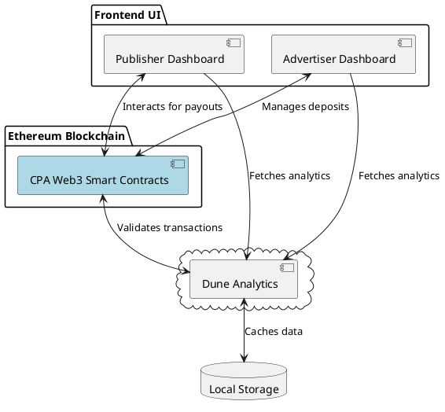
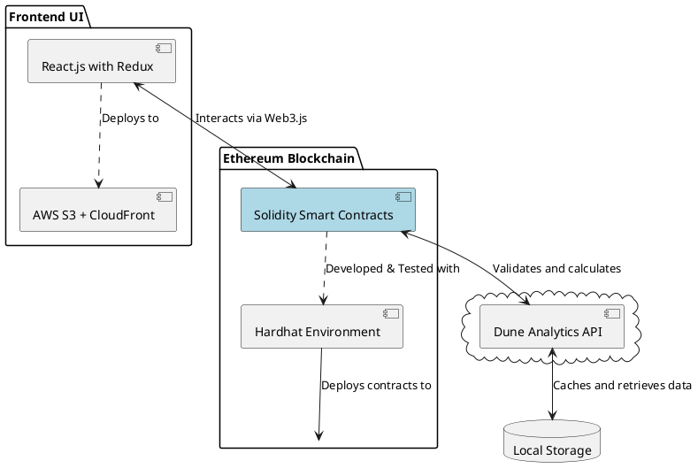

### High-Level Architecture

The high-level architecture of the CPA Web3 application will consist of several key components that interact with each other to facilitate the tracking, calculation, and payout of CPA transactions within the DeFi space.

**Key Components:**

1. **User Interface (UI):** A frontend platform for publishers and advertisers to interact with the CPA network, view statistics, and manage campaigns.
2. **Tracking Script:** Client-side JavaScript that tracks user actions and sends data to the analytics backend.
3. **Analytics Backend:** Dune Analytics integration for storing and processing transaction data.
4. **Smart Contract System:** Smart contracts deployed on the Ethereum blockchain for handling the business logic of the CPA network.
5. **Blockchain Network:** Ethereum mainnet or a suitable testnet environment where the smart contracts will be deployed.
6. **Contract Management System:** A suite of tools and services for deploying, managing, and verifying smart contracts, such as Hardhat and Etherscan.

### Low-Level Architecture with Technologies

For the low-level architecture, we'll delve into the specific technologies and best practices that will be applied to each component.

**Frontend UI:**
- **Technology:** React.js with Redux for state management.
- **Deployment:** Hosted on a cloud service like AWS S3 with CloudFront for global distribution.

**Tracking Script:**
- **Technology:** Vanilla JavaScript or a lightweight library such as Preact.
- **Security:** CORS for secure data transmission, HTTPS for encryption.

**Analytics Backend:**
- **Integration:** Dune Analytics with a dedicated database.
- **Data Retrieval:** API endpoints protected with OAuth for secure access from the smart contract.

**Smart Contract System:**
- **Language:** Solidity for Ethereum smart contract development.
- **Development Environment:** Hardhat for compilation, testing, and deployment.
- **Testing:** Mocha and Chai for writing and executing test cases.
- **Security Best Practices:** Use of the latest OpenZeppelin contracts for standardized secure components, implementation of checks-effects-interactions pattern to prevent reentrancy, and thorough testing to prevent common vulnerabilities like integer overflow, underflow, and front-running.

**Contract Management System:**
- **Deployment Tool:** Hardhat for scriptable deployment and Etherscan for contract verification.
- **Etherscan API:** To verify the source code of the deployed contracts automatically.

Each of these components will be developed, tested, and integrated according to the outlined technologies and best practices by the team, considering the individual's expertise and the urgency of the hackathon timeline.